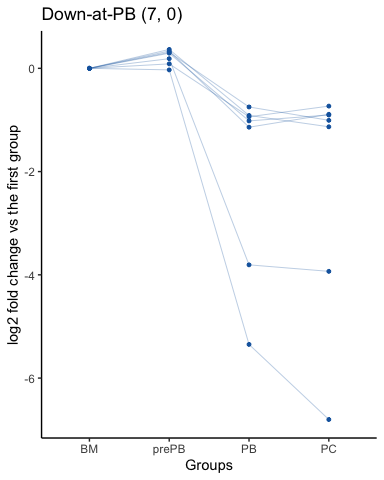

# stepprofiler

## Insrallation

``` r
# Install
if(!require(devtools)) install.packages("devtools")
devtools::install_github("kassambara/stepprofiler")
```

## Required package

``` r
library(DESeq2)
library(tidyverse)
library(stepprofiler)
theme_set(theme_classic())
```

## STEP 0: Display aivalable patterns

Available gene expression patterns:

``` r
patterns()
```

<!-- -->

## STEP 2: Import the data

Load the raw count, samples and gene annotation files. Note that the
sample file contains a column named “group”, which hold the different
groups to be compared.

``` r
set.seed(123)

data.dir <- system.file("rnaseq", "multiclass",
                        package = "stepprofiler")
# Import raw count
raw.count <- file.path(data.dir, "raw.count.txt") %>%
  read.delim(row.names = 1)
sample_n(raw.count, 5)
#   BM1 BM2 BM3 prePB1 prePB2 prePB3  PB1  PB2  PB3 PC1 PC2  PC3
# 1   0   0   0      0      0      0    0    0    0   0   0    0
# 2  12   0   6      8      7     12    5    1    5   2   1    7
# 3   0   2   1      0      0      0    3    0    0   0   0    0
# 4 760 722 554  10977   5035   3621 3798 1812 1359 894 898 1831
# 5   0   0   1      0      0      0    0    0    0   0   0    0

# Import sample annotation
samples <- file.path(data.dir, "samples.txt") %>%
  read.delim(row.names = 1)
sample_n(samples, 5)
#   group
# 1    BM
# 2 prePB
# 3    PB
# 4 prePB
# 5 prePB

# Import gene annotation file
gene.annotation <- file.path(data.dir, "gene.annotation.txt") %>%
  read.delim(row.names = 1)
sample_n(gene.annotation, 5)
#           ensembl   name
# 1 ENSG00000254770 OR4D7P
# 2 ENSG00000256498       
# 3 ENSG00000251059       
# 4 ENSG00000254681 PKD1P5
# 5 ENSG00000133704   IPO8
```

## STEP 3: Run DESeq2 pipeline

1.  Put raw count data and samples annotation together, and specify the
    column name containing the groups to be compared:

<!-- end list -->

``` r
dds <- DESeqDataSetFromMatrix(
  countData = raw.count, colData = samples, 
  design = ~ group
  )
```

2.  Normalize the data for sequencing depth:

<!-- end list -->

``` r
dds <- estimateSizeFactors( dds)
count.norm <- counts(dds, normalized = TRUE)
```

3.  Run DESeq using multicore parallel computation for speed:

<!-- end list -->

``` r
library(BiocParallel)
register(MulticoreParam(workers = 4) )
dds <- DESeq(dds, parallel = TRUE)
```

## STEP 4: Define threshold for active gene expression

The process is as follow:

1.  Compute gene expression mean per sample groups
2.  Visualize the distribution of gene mean per sample groups
3.  Decide a cutoff above which a given gene can be considered as
    actively expressed in a particular group

R function: `summarizeby()` [stepprofiler](#stepprofiler):

``` r
# Compute gene mean expression
gene.mean.by.grp <- count.norm %>%
  summarizeby(samples$group, fun = mean) %>%
  round(2) %>%
  as.data.frame()

# Create a tidy data frame for plotting
gene.mean.by.grp <- gene.mean.by.grp %>%
  mutate(gene.id = row.names(.)) %>%
  select(gene.id, everything()) %>%
  as_data_frame()
# Print mean expression
gene.mean.by.grp
# # A tibble: 2,000 x 5
#    gene.id              BM    PB    PC   prePB
#    <chr>             <dbl> <dbl> <dbl>   <dbl>
#  1 ENSG00000120686  4397.  7158. 7180. 3519.  
#  2 ENSG00000169246 12067.  2547. 3181. 3301.  
#  3 ENSG00000229239     0      0     0     0   
#  4 ENSG00000202147     0      0     0     0   
#  5 ENSG00000231356     0      0     0     0   
#  6 ENSG00000172954    89.3  271.  206.  557.  
#  7 ENSG00000077157   585.   500.  791.  328.  
#  8 ENSG00000258799     0      0     0     0   
#  9 ENSG00000171503   275.   537.  666.  918.  
# 10 ENSG00000240244     0      0     0     0.41
# # … with 1,990 more rows

# Plot the distribution of mean expression
# per group
gene.mean.by.grp %>%
  gather(key = "group", value = "mean.expr", -gene.id) %>%
  filter(mean.expr != 0) %>%
  ggplot(aes(log2(mean.expr+1))) +
  geom_density(aes(color = group))+
  geom_vline(xintercept = 6, linetype = "dashed")
```

<!-- -->

The distribution of the average normalized gene read counts for each
cell subpopulation is shown.

The distribution is bimodal for all cell subpopulations, defining one
group of genes with average normalized read counts \< 64 and another
group with average normalized read counts \> = 64.

Therefore, we defined 64 normalized read counts as a cutoff to define
transcripts with active expression.

## Temporal patterns of gene expression

``` r
# pairewise comparison
pwc <- dds %>% pairewise_compare(
  "group", c("BM",  "prePB", "PB", "PC"),
  active_exprs = 64, fc = 1, verbose = TRUE
  )
```

## one-step-up and one-step-down genes

Create the plots:

``` r
# One step up genes
step_up <- one_step_up(pwc, fc = 2)
step_down <- one_step_down(pwc, fc = 2)
# Plot profile
step_up_plots <- plot(
  step_up, transformby ="firststep", 
  color = "#B31B21", size = c(0.1, 1),
  getRegFunc = get_human_regulators,
  print_plot = FALSE
  )
step_down_plots <- plot(
  step_down, transformby ="firststep",  
  color = "#1465AC", size = c(0.1, 1), 
  getRegFunc = get_human_regulators, print_plot = FALSE
  )
```

Display the plots:

``` r
for(i in 1:length(step_up_plots)) {
  print(step_up_plots[[i]])
  print(step_down_plots[[i]])
}
```



## Impulse-up and Impulse-down genes

Create the plots:

``` r
# Get genes
impul_up <- impulsed_up(pwc, fc = 2)
impul_down <- impulsed_down(pwc, fc = 2)
# Plot profile
impul_up_plots <- plot(
  impul_up, transformby ="firststep", 
  color = "#B31B21", size = c(0.1, 1),
  getRegFunc = get_human_regulators, print_plot = FALSE
  )
impul_down_plots <- plot(
  impul_down, transformby ="firststep",  
  color = "#1465AC", size = c(0.1, 1),
  getRegFunc = get_human_regulators, print_plot = FALSE
  )
```

Display the plots:

``` r
for(i in 1:length(impul_up_plots)) {
  print(impul_up_plots[[i]])
  print(impul_down_plots[[i]])
}
```


